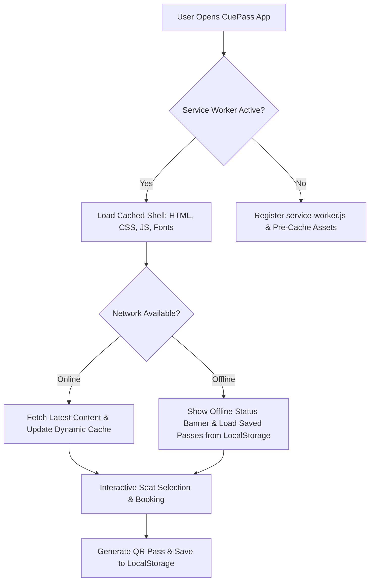
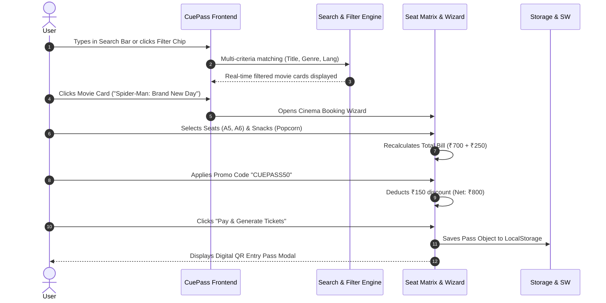

<div align="center">

# 🎟️ CuePass — Smart Event & Movie Ticket Booking PWA
### *A Production-Grade, Full-Stack Frontend BookMyShow Clone with Offline PWA Architecture*

<p align="center">
  <strong>Created & Engineered by:</strong><br/>
  <h3>👑 Baalamuruga Sivam B S</h3>
  <em>Founder & CEO of Silicorps</em>
</p>

[](#-creator--author)
[](#-creator--author)
[](https://developer.mozilla.org/en-US/docs/Web/HTML)
[](https://developer.mozilla.org/en-US/docs/Web/CSS)
[](https://developer.mozilla.org/en-US/docs/Web/JavaScript)
[](https://web.dev/progressive-web-apps/)

<br/>

[✨ Live Features](#-key-features) • [📱 PWA & Offline Engine](#-pwa--offline-architecture) • [🎬 Interactive Seat Matrix](#-interactive-cinema-booking-engine) • [🚀 Quick Start](#-getting-started) • [👑 Creator & Author](#-creator--author)

<br/>

</div>

---

## 📖 Overview

**CuePass** is an ultra-rich, responsive frontend web application and **Progressive Web App (PWA)** inspired by BookMyShow. Engineered by **Baalamuruga Sivam B S** (*Founder & CEO of Silicorps*), it is built with pure **Vanilla HTML5, CSS3, and modern ES6 JavaScript**, delivering an end-to-end event discovery and ticket booking experience with zero external framework dependencies.

From **real-time search autocomplete** and **multi-filter chips** to an **interactive cinema seat layout**, **live promo discount engine**, and **offline digital ticket pass generator with turnstile QR codes**, CuePass demonstrates high-fidelity frontend engineering.

---

## ✨ Key Features

### 1. 🧭 BookMyShow Dual Navigation Bar
- **Top Primary Bar:** Brand logo with glowing crimson accent (`#f84464`), city selector modal (`Chennai ▾`), red `Sign in` button, and side drawer hamburger menu.
- **Smart Search Bar:** Real-time search with clear button (`X`) and a floating dropdown displaying **Trending Searches** (*Spider-Man*, *Vishwanath and Sons*, *A.R. Rahman Live*).
- **Secondary Sub-Navbar:** Category navigation (`Movies`, `Stream`, `Events`, `Plays`, `Sports`, `Activities`) and utility links (`ListYourShow`, `Offers`, `Gift Cards`).

### 2. 🎡 Promotional Hero Banner Carousel
- Smooth auto-sliding banner loop with manual next/prev arrows, clickable pagination dot indicators, and **touch swipe gesture support** for mobile screens.

### 3. 🎯 Recommended Movies (Exact UI Match)
- High-definition movie cards featuring:
  - **Rating & Likes Badges:** `👍 141K+ Likes`, `★ 9.2/10 82.6K+ Votes`, `★ 8.9/10 297K+ Votes`.
  - **Smooth Horizontal Carousel:** Controlled via `<` and `>` arrow buttons with momentum scroll.
  - **Hover Micro-Animations:** Poster elevation and animated *"Book Tickets"* pill button.

### 4. 🏷️ Multi-Filter & Genre Navigation
- **Language Chips:** Instant live filtering by *All*, *Tamil*, *English*, *Hindi*, *Telugu*.
- **Genre Chips:** Multi-criteria filtering for *Action*, *Drama*, *Comedy*, *Sci-Fi*, *Romantic*.

### 5. 💺 Deep Interactive Cinema Seat Matrix
- **Curved Screen Perspective:** Animated glowing cinema screen indicator (*"All eyes this way please!"*).
- **Tiered Seating & Real-Time Calculations:**
  - **VIP Recliner (Row A):** ₹350 / seat
  - **Premium (Rows B, C):** ₹220 / seat
  - **Executive (Row D):** ₹160 / seat
- **Clickable Seat States:** Real-time toggling between *Available*, *Selected (Green Glow)*, and *Sold (Grey)* with a maximum limit of 8 seats per booking.
- **Showtime & Date Switcher:** Quick selection between *10:30 AM*, *02:15 PM*, *06:45 PM*, *10:00 PM*.

### 6. 🍿 Snacks & Food Add-ons
- One-click add/remove for theater snacks (*Large Caramel Popcorn ₹250*, *Cheese Nachos ₹220*, *Chilled Pepsi ₹120*) with instant bill recalculation.

### 7. 🎟️ Promo Code Engine
- Dynamic coupon applicator supporting:
  - `CUEPASS50` — ₹150 Instant Discount
  - `CUEPASS150` — ₹150 Flat Promo
  - `BMSFIRST` — ₹100 Welcome Offer

### 8. 📱 Digital Entry Pass & QR Code Receipt
- Confirmed booking generates a printable, realistic digital ticket pass featuring:
  - Unique Booking ID (e.g. `#CUE-894231`).
  - Movie title, theater name, Audi 3 screen, showtime, and seat numbers.
  - Authentic QR Code for cinema turnstile verification.
  - Direct `window.print()` action for printing or saving as PDF.

---

## 📱 PWA & Offline Architecture

CuePass is configured as a standalone **Progressive Web App (PWA)** that can be installed directly onto Android, iOS, Windows, and macOS devices.



### PWA Capabilities Included:
- **`manifest.json`:** `display: standalone`, custom maskable vector icon, orientation lock, and home screen shortcuts.
- **`service-worker.js`:** Cache-First strategy for static assets with automatic network fallback.
- **Offline Entry Pass Vault:** Booked tickets are stored in browser `localStorage`, allowing users to open and scan tickets even without cellular data or Wi-Fi.
- **App Install Banner:** Native installation prompt using `beforeinstallprompt`.
- **Tactile Haptic Feedback:** Physical vibration feedback on seat tap and checkout via `navigator.vibrate()`.
- **Mobile Bottom App Bar:** Fixed 5-tab native mobile navigation (`Movies`, `Events`, `Search`, `My Passes`, `Account`).

---

## 🎬 Interactive Booking Flowchart



---

## 📁 Project Structure

```
Task 1/
├── index.html          # Semantic HTML5 markup, modals & PWA meta tags
├── style.css           # Custom responsive CSS design system (BookMyShow theme)
├── script.js           # Interactive UI logic, seat matrix, filters & PWA events
├── manifest.json       # W3C Web App Manifest for mobile installation
├── service-worker.js   # Service worker for offline caching & background sync
├── icon.svg            # High-resolution vector app icon (maskable)
└── README.md           # Comprehensive project documentation
```

---

## 🎨 Design System & Color Palette

| Element | Hex Code | Preview | Purpose |
| :--- | :--- | :--- | :--- |
| **Brand Primary** | `#f84464` |  | Primary buttons, logo accent, rating stars |
| **Dark Surface** | `#1e293b` |  | Announcement bar, drawer header, PWA theme |
| **Canvas Background** | `#f5f5fa` |  | Page body background |
| **Card / Modal White** | `#ffffff` |  | Primary nav bar, movie cards, modals |
| **Seat Available** | `#2dc492` |  | Available & selected seat borders / fill |
| **Primary Text** | `#333333` |  | Headings, titles, and body content |

---

## 👑 Creator & Author

<div align="center">

### **Baalamuruga Sivam B S**
**Founder & CEO — Silicorps**  
*Full Stack Web Development & Software Engineering*

[](https://linkedin.com)
[](https://github.com)
[](https://github.com)

</div>

---

<div align="center">

### 🌟 Developed for Full Stack Web Development Internship (Task 1)
*Crafted with passion by **Baalamuruga Sivam B S (Founder & CEO of Silicorps)***

</div>
